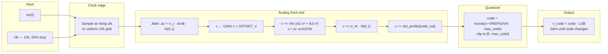
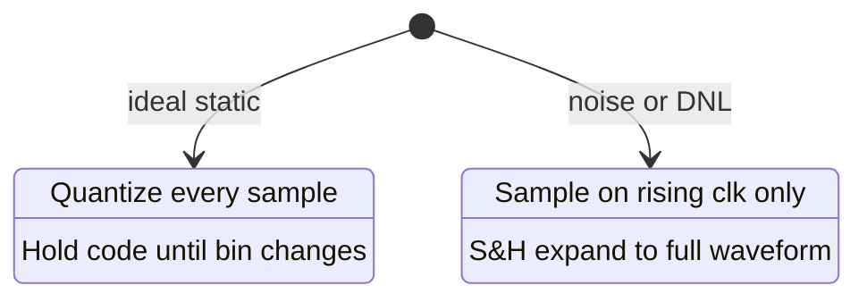
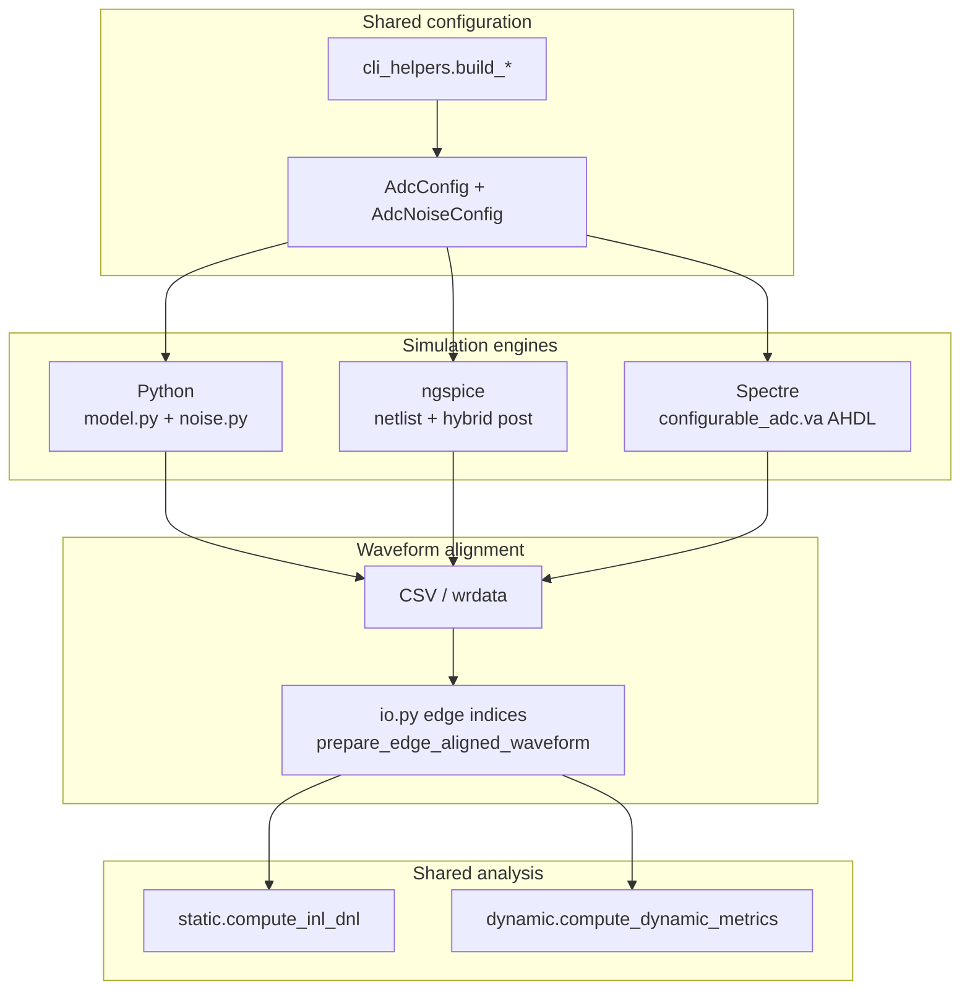

# ADC Behavioral Model Reference

This document describes how the configurable ADC behavioral model is defined, simulated, and analyzed in **adc-model**. For installation, CLI usage, batch scripts, and engine selection, see [README.md](README.md). **MODEL.md** is the deep modeling reference: signal flow, equations, sampling policies, testbenches, and multi-engine behavior.

The Python implementation in `src/adc_model/` is a numerical twin of the reference Verilog-A module [`veriloga/configurable_adc.va`](veriloga/configurable_adc.va). Post-simulation metrics (`compute_inl_dnl`, `compute_dynamic_metrics`) are shared across engines.

---

## Overview

The model represents a **single-channel, unipolar (or differential-referenced) sampled ADC** at the behavioral level:

- **Analog front end:** aperture jitter, static gain/offset mismatch, weak even/odd nonlinearity, input-referred thermal noise, optional per-code comparator threshold spread (DNL).
- **Quantizer:** mid-tread rounding to integer codes `0 … max_code`, with saturation at the rails.
- **Digital output:** `v_code = code × LSB` on a sample-and-hold bus, updated on clock events.

Two standard testbenches drive characterization:

| Testbench | Stimulus | Primary metrics | Entry points |
| --- | --- | --- | --- |
| **Static** | Slow monotonic ramp | INL, DNL | `simulate_static()` in [`src/adc_model/model.py`](src/adc_model/model.py), `scripts/run_static.py` |
| **Dynamic** | Coherent full-scale sine | SNDR, SFDR, THD, ENOB, harmonics | `simulate_dynamic()` in [`src/adc_model/model.py`](src/adc_model/model.py), `scripts/run_dynamic.py` |

Waveform I/O and clock-aligned resampling live in [`src/adc_model/io.py`](src/adc_model/io.py). Configuration dataclasses are in [`src/adc_model/config.py`](src/adc_model/config.py). Noise and quantization kernels are in [`src/adc_model/noise.py`](src/adc_model/noise.py). Static and dynamic analysis are in [`src/adc_model/static.py`](src/adc_model/static.py) and [`src/adc_model/dynamic.py`](src/adc_model/dynamic.py).

---

## Relationship to `configurable_adc.va`

[`veriloga/configurable_adc.va`](veriloga/configurable_adc.va) is the **authoritative analog definition** for Cadence Spectre (AHDL). The Python package mirrors:

| Concept | Verilog-A | Python |
| --- | --- | --- |
| Parameters | `BITS`, `VREFP`, `VREFN`, `GAIN`, `OFFSET_V`, `SIGMA_THERMAL`, `JITTER_RMS`, `NONLINEARITY_A2/A3`, `DNL_SIGMA_LSB`, `NOISE_SEED` | `AdcConfig`, `AdcNoiseConfig` |
| Sampling | `@(cross(clk))` — one conversion per rising edge | `adc_capture_edge_indices()`, `static_capture_edge_indices()` |
| Output hold | `transition(code_int * lsb, …)` on `v_code` | `_fill_sample_hold_codes()` expands per-edge codes to full-rate S&H |
| DNL LUT | Fixed per-code offsets at `initial_step` (12× `$random` sum, mean ≈ 0) | `build_dnl_profile()` — `Normal(0, dnl_sigma_lsb)` per code, seed `noise_seed + 17` |

**Processing order** is identical in intent (see [Signal chain](#signal-chain-and-processing-order)):

> jitter → gain/offset → A2/A3 → thermal → DNL → quantize

Verilog-A applies jitter as `GAIN * (vin_sample + v_jitter) + OFFSET_V` where `v_jitter = JITTER_RMS * (vin_sample - vin_prev) / dt_sample * (sum_u - 6)`. Python edge sampling uses the same structure in `apply_analog_front_end_at_edges()`.

Minor implementation differences (RNG, event scheduling, dense transient grids) explain cross-engine metric gaps documented in [Multi-engine architecture](#multi-engine-architecture) and [Known cross-engine discrepancies](#known-cross-engine-discrepancies).

---

## Signal chain and processing order



**Ideal path** (`AdcNoiseConfig.enabled == False` and no DNL profile): only `v_eff = gain · vin + offset_v` then quantize.

**Dense-array path** (`apply_analog_front_end`): same chain evaluated at every time point (used by `quantize_array()` for bulk samples). **Edge path** (`apply_analog_front_end_at_edges`): one front-end evaluation per ADC clock edge — matches Verilog-A `@(cross(clk))` and is used for static (noisy), dynamic, and ngspice post-processing.

---

## Equations

### Reference and LSB

Let `Vfs = VREFP − VREFN`, `max_code = 2^BITS − 1`, `num_codes = max_code + 1`.

\[
\text{LSB} = \frac{Vfs}{\text{max\_code}}, \qquad v_{cm} = \frac{VREFP + VREFN}{2}
\]

Defined as properties on `AdcConfig` in [`src/adc_model/config.py`](src/adc_model/config.py).

### Gain and offset

\[
v \leftarrow G \cdot v_{in} + V_{offset}
\]

(`GAIN`, `OFFSET_V` / `gain`, `offset_v`.)

### Aperture jitter

On each clock edge \(k\) with sample interval \(\Delta t_k\) (seconds):

\[
\frac{dv}{dt} \approx \frac{v_{in}[k] - v_{in}[k-1]}{\Delta t_k}, \qquad
\Delta v_{jitter} = \sigma_{jitter} \cdot \frac{dv}{dt} \cdot \mathcal{N}(0,1)
\]

\[
v \leftarrow v + \Delta v_{jitter} \quad \text{(before gain/offset in VA; same effective order as Python edge path)}
\]

In [`src/adc_model/noise.py`](src/adc_model/noise.py), jitter is applied to `vin_sample` **before** `gain` and `offset_v` on edges; the full-array path uses `np.gradient(vin, dt)`.

**Units:** `jitter_rms_s` / `JITTER_RMS` in **seconds** (RMS aperture uncertainty).

### Weak nonlinearity (A2 / A3)

Normalized input \(x = (v - v_{cm}) / Vfs\):

\[
v \leftarrow v + V_{fs}\,\bigl(A_2\, x^2 + A_3\, x^3\bigr)
\]

Coefficients are **dimensionless vs full-scale** (same convention in VA comments and `AdcNoiseConfig`).

### Thermal noise

\[
v \leftarrow v + \mathcal{N}(0,\, \sigma_{th}^2)
\]

**Units:** `sigma_thermal_v` / `SIGMA_THERMAL` in **volts** (RMS, input-referred).

### Per-code DNL spread

A fixed profile `dnl_profile[k]` (volts) is built once:

\[
\text{dnl\_profile}[k] = \mathcal{N}(0,\, \sigma_{DNL}^2) \cdot \text{LSB}
\]

At quantization time, the estimated code index \(k = \lfloor (v - VREFN) / \text{LSB} \rfloor\) (clipped) adds `dnl_profile[k]` to \(v\). **Units:** `dnl_sigma_lsb` / `DNL_SIGMA_LSB` in **LSB RMS**.

### Quantization

From [`quantize_front_end()`](src/adc_model/noise.py):

\[
\text{code\_real} = \frac{v - VREFN}{Vfs} \cdot \text{max\_code}, \qquad
\text{code} = \left\lfloor \text{code\_real} + 0.5 \right\rfloor
\]

Then clip to `[0, max_code]`. Verilog-A uses the same `floor(code_real + 0.5)` with explicit rail saturation for `v_eff ≤ VREFN` and `v_eff ≥ VREFP`.

### Digital output

\[
v_{code} = \text{code} \cdot \text{LSB}
\]

(`code_to_v_code()` in [`src/adc_model/model.py`](src/adc_model/model.py).)

### Coherent input tone (dynamic testbench)

For capture length \(N\) and sample rate \(f_s\), choose integer bin \(k\) with \(0 < k < N/2\):

\[
f_{in} = k \cdot \frac{f_s}{N}
\]

\[
v_{in}(t) = v_{mid} + A \sin(2\pi f_{in} t), \quad
v_{mid} = \frac{VREFP + VREFN}{2}
\]

Default \(k = 997\), \(N = 8192\), \(f_s = 1\,\text{MHz}\) ⇒ \(f_{in} \approx 121.704\,\text{kHz}\). Implemented in `simulate_dynamic()`; `fin_hz` may be set directly or derived from `coherent_bin`.

Default amplitude: \(A = 0.95 \cdot Vfs / 2\) (near full-scale sine).

### ENOB (dynamic metrics)

From [`compute_dynamic_metrics()`](src/adc_model/dynamic.py), after coherent FFT and SNDR in dB:

\[
\text{ENOB} = \frac{\text{SNDR}_{dB} - 1.76}{6.02}
\]

SNDR uses signal power in the detected fundamental bin versus all other non-DC bins excluding guarded regions around the fundamental and harmonics. THD sums harmonic tone powers (orders 2…`num_harmonics+1`, with aliasing folded into rFFT bins). SFDR is the ratio of signal power to the largest non-excluded spur.

**dBFS reference:** sine peak at `max_code / 2` (full-scale amplitude assumption for the FFT).

---

## Clock and sampling policies

The clock is a **50% duty square wave** with period \(1/f_s\), from `clock_pulse_waveform()` in [`src/adc_model/io.py`](src/adc_model/io.py), matching Spectre `vsource` pulse and ngspice `PULSE` netlists.

### Dynamic capture

- **Always** one ADC decision per clock period on rising edges (`adc_capture_edge_indices()`).
- On a **uniform grid** with \(\Delta t = 1/f_s\), every sample index `0 … N−1` is an edge.
- On **dense transients** (\(\Delta t \ll 1/f_s\)), rising edges are detected from `clk`; `prepare_edge_aligned_waveform()` may apply a **one-point `v_code` settle delay** (`_V_CODE_EDGE_OFFSET = 1`) to match VA output timing after `@(cross(clk))`.
- Per-edge codes are expanded to a full-rate S&H waveform via `_fill_sample_hold_codes()` for CSV/plot export.

### Static capture — ideal (no noise, no DNL profile)

- Input: ramp from `VREFN + 0.5·LSB` to `VREFP − 0.5·LSB` over `num_codes × samples_per_code` points.
- **Quantize every clock** on effective voltage `gain·vin + offset_v`.
- **Held output** (`v_code` / `code` bus): update only when the instantaneous quantized bin **changes** — Verilog-A-style S&H, not a new code every clock (`_simulate_static_ideal_codes()`).

### Static capture — noisy or DNL-enabled

- **One conversion per rising clock edge** (same as VA / Spectre / dynamic).
- `static_capture_edge_indices()` picks indices on uniform `t = n/fs` or searchsorted targets on dense grids.
- If `noise.enabled` and `samples_per_code < 16`, depth is raised to **16** clocks per code for histogram stability.
- Edge front-end → quantize → `_fill_sample_hold_codes()` for the output bus.



---

## Configuration parameters

### `AdcConfig` ([`src/adc_model/config.py`](src/adc_model/config.py))

| Field | Dataclass default | CLI default (`cli_helpers`) | Unit | Description |
| --- | --- | --- | --- | --- |
| `bits` | `10` | `10` | — | Resolution; `max_code = 2^bits − 1` |
| `vrefp` | `1.0` | `1.0` | V | Positive reference |
| `vrefn` | `0.0` | `0.0` | V | Negative reference |
| `gain` | `1.0` | `1.01` | — | Static gain mismatch |
| `offset_v` | `0.0` | `5e-3` | V | Input-referred offset |
| `fs_hz` | `1e6` | `1e6` | Hz | Sample / clock rate |

**Note:** Programmatic defaults in `AdcConfig` are ideal-aligned; **testbench scripts** use CLI defaults from [`src/adc_model/cli_helpers.py`](src/adc_model/cli_helpers.py) (`gain=1.01`, `offset_v=5 mV`) unless overridden.

Derived: `lsb`, `max_code`, `num_codes`.

### `AdcNoiseConfig` ([`src/adc_model/config.py`](src/adc_model/config.py))

| Field | Dataclass default | CLI default | Unit | Description |
| --- | --- | --- | --- | --- |
| `sigma_thermal_v` | `0.0` | `250e-6` | V (RMS) | Input-referred white noise |
| `jitter_rms_s` | `0.0` | `500e-15` | s (RMS) | Aperture jitter |
| `nonlinearity_a2` | `0.0` | `0.0` | — | 2nd-order vs \(V_{fs}\) |
| `nonlinearity_a3` | `0.0` | `-0.002` | — | 3rd-order vs \(V_{fs}\) |
| `dnl_sigma_lsb` | `0.0` | `0.08` | LSB (RMS) | Per-code threshold spread |
| `noise_seed` | `1` | `1` | — | RNG seed |

`enabled` is true if any of `sigma_thermal_v`, `jitter_rms_s`, `nonlinearity_a2`, `nonlinearity_a3`, or `dnl_sigma_lsb` is non-zero. **`--ideal`** on the CLI builds an all-zero `AdcNoiseConfig`.

### Verilog-A parameters ([`veriloga/configurable_adc.va`](veriloga/configurable_adc.va))

| Parameter | Default | Maps to |
| --- | --- | --- |
| `BITS` | `10` | `bits` |
| `VREFP`, `VREFN` | `1.0`, `0.0` | `vrefp`, `vrefn` |
| `GAIN`, `OFFSET_V` | `1.0`, `0.0` | `gain`, `offset_v` |
| `SIGMA_THERMAL` | `0.0` | `sigma_thermal_v` |
| `JITTER_RMS` | `0.0` | `jitter_rms_s` |
| `NONLINEARITY_A2`, `NONLINEARITY_A3` | `0.0` | `nonlinearity_a2`, `nonlinearity_a3` |
| `DNL_SIGMA_LSB` | `0.0` | `dnl_sigma_lsb` |
| `NOISE_SEED` | `1` | `noise_seed` |

### Static / dynamic testbench knobs

| Parameter | Default | Script | Description |
| --- | --- | --- | --- |
| `samples_per_code` | `4` (effective `16` if noise on) | `run_static.py` | Ramp length per code |
| `num_samples` | `8192` | `run_dynamic.py` | FFT capture length |
| `coherent_bin` | `997` | `run_dynamic.py` | Integer FFT bin for \(f_{in}\) |
| `inl_dnl_method` | `auto` | `run_static.py` | See [INL/DNL methods](#inldnl-methods) |

---

## Static ramp testbench

**Implementation:** `simulate_static()` in [`src/adc_model/model.py`](src/adc_model/model.py).

1. Build uniform time grid `t[n] = n / f_s`, length `num_codes × samples_per_code` (with noise floor on `samples_per_code`).
2. Ramp `vin` between code centers: `linspace(VREFN + 0.5·LSB, VREFP − 0.5·LSB, num_samples)` so each code is visited without saturation pile-up at the ends.
3. Generate `clk` via `clock_pulse_waveform()`.
4. Run ideal or noisy sampling policy (above).
5. Return dict: `time`, `vin`, `clk`, `v_code`, `code`.

**Analysis:** `compute_inl_dnl(vin, codes, cfg, method=…)` in [`src/adc_model/static.py`](src/adc_model/static.py). Metrics exclude **saturation shoulders**: interior codes only (`_EDGE_CODE_MARGIN = 1` from each end). Plots: `plot_inl_dnl()` → SVG.

**CLI:** `python scripts/run_static.py --output-dir …` — see [README.md § Static INL/DNL](README.md#static-inldnl-only).

---

## Dynamic coherent FFT testbench

**Implementation:** `simulate_dynamic()` in [`src/adc_model/model.py`](src/adc_model/model.py).

1. Coherent sine on `vin` (see [Coherent input tone](#coherent-input-tone-dynamic-testbench)).
2. Clock at `f_s`; capture at `adc_capture_edge_indices()`.
3. Front-end at edges (noisy) or `gain·vin + offset` at edges (ideal); quantize; S&H expand to length `N`.
4. Return dict including `fin_hz`.

**Analysis:** `compute_dynamic_metrics(codes, cfg, fin_hz=…)` in [`src/adc_model/dynamic.py`](src/adc_model/dynamic.py):

- DC-removed codes → `rfft`; one-sided power scaling on interior bins.
- Fundamental bin refined near expected coherent bin; harmonics located with aliasing fold `alias_bin = N − raw_bin`.
- **SNDR**, **SFDR**, **THD**, **ENOB** as in [ENOB](#enob-dynamic-metrics).

**CLI:** `python scripts/run_dynamic.py --output-dir …` — see [README.md § Dynamic spectrum](README.md#dynamic-spectrum-only).

---

## INL/DNL methods

All methods report DNL and INL in **LSB** versus interior code index `1 … max_code−1`.

### Transition method (`method="transition"`)

[`_compute_inl_dnl_transition()`](src/adc_model/static.py):

1. Find **rising code edges** on the ramp: where `codes[i] > codes[i-1]`.
2. Transition voltage for code \(k\): midpoint of `vin` at the crossing, `0.5·(vin[i] + vin[i-1])`.
3. Endpoints fixed: `transitions[0] = VREFN`, `transitions[max_code] = VREFP`; gaps filled by linear interpolation.
4. Code bin widths \(W_k = \text{transitions}[k+1] - \text{transitions}[k]\).
5. \(\text{DNL}_k = W_k / \text{LSB} - 1\); \(\text{INL} = \text{cumsum}(\text{DNL})\) with **end-point normalization** (linear ramp removed from INL endpoints).

Best for **clean, monotonic** ideal ramps with many distinct transitions.

### Histogram method (`method="histogram"`)

[`compute_inl_dnl_histogram()`](src/adc_model/static.py):

1. Histogram hit counts per code on interior codes (exclude `0` and `max_code`).
2. Expected hits = mean of active interior counts.
3. \(\text{DNL}_k = \text{counts}_k / \text{expected} - 1\); INL from cumulative DNL with the same endpoint normalization.

Robust when **thermal noise dithers** codes and transition tracking is sparse.

### Auto selection (`method="auto"`)

In `compute_inl_dnl()`:

- Count `unique_transitions = sum(codes[1:] > codes[:-1])`.
- If `unique_transitions < max_code / 2`, use **histogram**; else **transition**.

**Script default:** `resolve_inl_dnl_method()` in [`src/adc_model/static_compare.py`](src/adc_model/static_compare.py) forces **`histogram`** when `noise.enabled`, and **`auto`** when ideal — matching `run_static.py` behavior.

| Scenario | Typical method |
| --- | --- |
| `--ideal` static | `auto` → transition (many edges) |
| Default noise static | `histogram` |
| Forced `--inl-dnl-method` | User choice |

---

## Multi-engine architecture



| Engine | Role | Key files |
| --- | --- | --- |
| **Python** | Reference behavioral twin; fastest regression | [`src/adc_model/model.py`](src/adc_model/model.py), [`src/adc_model/noise.py`](src/adc_model/noise.py) |
| **ngspice** | Open-source SPICE netlist check; PULSE `1/fs` clock | [`src/adc_model/ngspice_engine.py`](src/adc_model/ngspice_engine.py), `testbench/ngspice/` |
| **Spectre** | Cadence sign-off on Verilog-A | [`src/adc_model/spectre_engine.py`](src/adc_model/spectre_engine.py), `testbench/spectre/` |

**ngspice hybrid path:** The netlist runs ideal quantization in SPICE; when thermal noise or DNL spread is enabled, **`apply_analog_front_end_at_edges()` / `apply_post_front_end_noise()`** re-applies those effects in Python at clock edges with the same `noise_seed` so open-source CI stays deterministic (`tests/test_model_parity.py`).

**Spectre:** Runs AHDL directly; exported dense waveforms are downsampled with [`src/adc_model/io.py`](src/adc_model/io.py) to one sample per `1/fs` before metrics.

Batch all six runs: `./scripts/run_all_simulations.sh` — documented in [README.md § Run all six simulations](README.md#run-all-six-simulations).

---

## Known cross-engine discrepancies

Metrics formulas are **shared**; differences come from **waveform generation** (RNG, scheduling, grid density).

### Python vs ngspice

For default-noise settings, static and dynamic metrics should match to **numerical noise**:

| Metric | Typical agreement |
| --- | --- |
| Static max \|DNL\|, \|INL\| | Identical sample/transition counts |
| Dynamic SNDR / ENOB | Within ~0.01 dB / 0.01 bit |
| Dynamic SFDR | Within a few tenths of a dB (FFT numerics) |

Treat **Python as the golden reference** for CI. ngspice validates netlist and clock wiring.

`compare_static_engines.py --check-parity` vs Python: \|DNL\| ≤ 0.02 LSB, \|INL\| ≤ 0.02 LSB, transition count ratio 0.98–1.02.

### Spectre — static

| Observation | Cause |
| --- | --- |
| Far fewer **code transitions** on ramp (~1000 vs ~4800) | VA `$random` vs NumPy; AHDL event scheduling; transition detector on CSV |
| Lower **hits std**, often lower **max \|INL\|** (~0.4 LSB) | Smoother per-code histogram |
| Same **max \|DNL\|** (e.g. 1.000 LSB) | Shared thin-bin / edge artifact, not bit-identical profiles |

Noisy static analysis uses **histogram** INL/DNL; Spectre is for VA sign-off, not bit-exact INL curves vs Python.

Parity check: \|DNL\| ≤ 0.02 LSB, \|INL\| ≤ 0.5 LSB (transitions not checked).

### Spectre — dynamic

Same FFT pipeline on each CSV; captured codes differ slightly:

- **SNDR / ENOB** may be ~2 dB higher (less in-band noise in FFT).
- **SFDR** may be ~2 dB lower.
- **THD** usually within ~1 dB.

Use Python/ngspice for tight regression; Spectre for ballpark VA validation.

### Interpreting large static INL

With CLI defaults (`gain = 1.01`, `offset_v = 5 mV` on 1 V full-scale, 10-bit), **max \|INL\| ≈ 4+ LSB** is dominated by gain/offset error, not `dnl_sigma_lsb = 0.08` alone. Use `--ideal` for quantizer-limited baseline (~0.25 LSB max \|DNL\|, ~61.5 dB SNDR).

Representative batch numbers and engine-selection guidance: [README.md § Cross-engine agreement](README.md#cross-engine-agreement-and-discrepancies).

---

## Python API quick reference

```python
from adc_model import AdcConfig, AdcNoiseConfig
from adc_model import simulate_static, simulate_dynamic
from adc_model import compute_inl_dnl, compute_dynamic_metrics

cfg = AdcConfig(bits=10, fs_hz=1e6)
noise = AdcNoiseConfig(sigma_thermal_v=250e-6, dnl_sigma_lsb=0.08)

static = simulate_static(cfg, samples_per_code=4, noise=noise)
linearity = compute_inl_dnl(static["vin"], static["code"].astype(int), cfg)

dynamic = simulate_dynamic(cfg, num_samples=8192, coherent_bin=997, noise=noise)
metrics = compute_dynamic_metrics(
    dynamic["code"].astype(int), cfg, fin_hz=float(dynamic["fin_hz"][0])
)
```

Public exports: [`src/adc_model/__init__.py`](src/adc_model/__init__.py).

---

## File index

| Path | Role |
| --- | --- |
| [`src/adc_model/model.py`](src/adc_model/model.py) | `simulate_static`, `simulate_dynamic`, ideal S&H, orchestration |
| [`src/adc_model/noise.py`](src/adc_model/noise.py) | Front-end chain, DNL profile, `quantize_front_end` |
| [`src/adc_model/config.py`](src/adc_model/config.py) | `AdcConfig`, `AdcNoiseConfig` |
| [`src/adc_model/io.py`](src/adc_model/io.py) | Clock, edge indices, CSV/wrdata, alignment |
| [`src/adc_model/static.py`](src/adc_model/static.py) | INL/DNL (transition, histogram, auto), plots |
| [`src/adc_model/dynamic.py`](src/adc_model/dynamic.py) | FFT metrics, spectrum plots |
| [`src/adc_model/cli_helpers.py`](src/adc_model/cli_helpers.py) | CLI defaults and `--ideal` handling |
| [`veriloga/configurable_adc.va`](veriloga/configurable_adc.va) | Reference Verilog-A ADC |
| [`README.md`](README.md) | Installation, CLI, engines, project layout |
