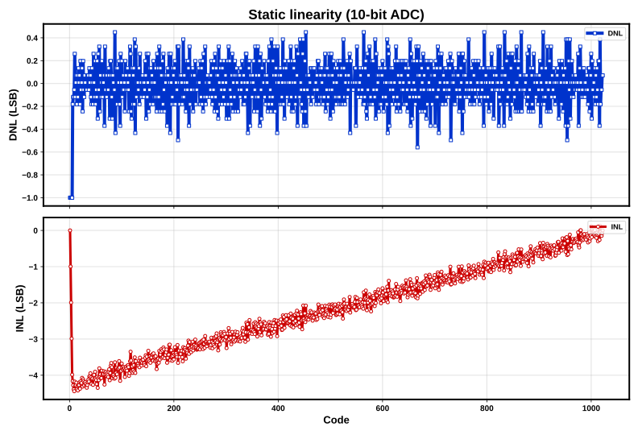
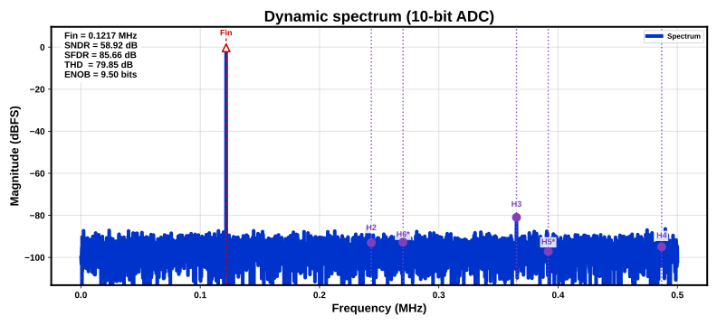

# ADC Simulation Summary

Generated: 2026-06-05 18:02:27 UTC

Behavioral simulation of `configurable_adc` with static INL/DNL and dynamic FFT analysis.

## Input Configuration

### ADC Core

| Parameter | Value |
| --- | --- |
| Resolution | 10 bits |
| Full-scale range | 0 V to 1 V |
| Ideal LSB | 977.517 uV |
| Sample rate | 1 MHz |
| Gain | 1.01 |
| Offset | 5 mV |

### Noise and Nonlinearity

| Parameter | Value |
| --- | --- |
| Thermal noise (RMS) | 250 uV |
| Aperture jitter (RMS) | 500 fs |
| Nonlinearity A2 | 0 |
| Nonlinearity A3 | -0.002 |
| DNL spread (RMS) | 0.08 LSB |
| Random seed | 1 |

### Static Testbench

| Parameter | Value |
| --- | --- |
| Engine | Python behavioral model |
| Stimulus | Slow ramp across full input range |
| Samples per code | 4 |
| INL/DNL method | histogram |
| Waveform CSV | static_waveform.csv |

### Dynamic Testbench

| Parameter | Value |
| --- | --- |
| Engine | Python behavioral model |
| Stimulus | Coherent full-scale sine |
| Capture length | 8192 samples |
| Coherent bin | 997 |
| Input tone | 121.704 kHz |
| Waveform CSV | dynamic_waveform.csv |

## Static Linearity Results

| Metric | Value |
| --- | --- |
| Max DNL (abs) | 1.000 LSB |
| Max INL (abs) | 4.441 LSB |

## Dynamic Spectrum Results

| Metric | Value |
| --- | --- |
| Input tone | 121.704 kHz |
| SNDR | 58.92 dB |
| SFDR | 85.66 dB |
| THD | 79.85 dB |
| ENOB | 9.50 bits |

### Identified Harmonics

| Tone | Frequency | Magnitude |
| --- | --- | --- |
| Fin | 121.704 kHz | 77.91 dBFS |
| H2 | 243.408 kHz | -14.73 dBFS |
| H3 | 365.112 kHz | -2.71 dBFS |
| H4 | 486.816 kHz | -16.73 dBFS |
| H5* | 391.724 kHz | -18.93 dBFS |
| H6* | 270.02 kHz | -14.49 dBFS |

Aliased harmonics are marked with `*`.

## Output Files

| Artifact | Path |
| --- | --- |
| Static waveform | static_waveform.csv |
| INL/DNL figure | inl_dnl.svg |
| Dynamic waveform | dynamic_waveform.csv |
| Spectrum figure | spectrum.svg |
| Verilog-A model snapshot | veriloga/configurable_adc.va |
| Simulation log | logs/python_static.log |
| Simulation log | logs/python_dynamic.log |
